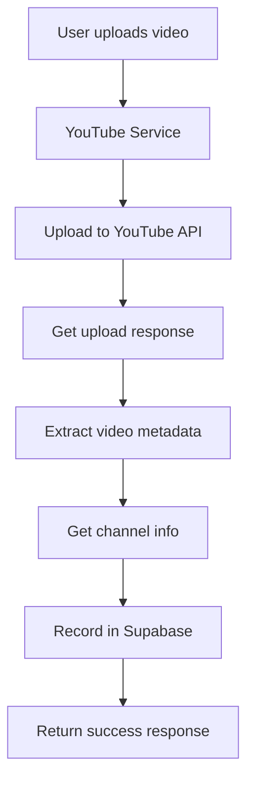

# YouTube Video Upload Integration with Supabase

This document explains how video upload information is automatically passed to Supabase through the `youtube_data_service` when users post videos to YouTube.

## Overview

When a user uploads a video to YouTube through the application, the system automatically:

1. Uploads the video to YouTube using the YouTube Data API
2. Records the video information in the Supabase database
3. Creates or updates channel information if needed
4. Provides tracking and analytics capabilities

## Architecture

### Components

1. **YouTube Service** (`app/services/youtube_service.py`)
   - Handles YouTube API interactions
   - Manages video uploads to YouTube
   - Integrates with youtube_data_service for database recording

2. **YouTube Data Service** (`app/services/youtube_data_service.py`)
   - Manages all YouTube-related database operations
   - Records video uploads in Supabase
   - Handles channel creation and updates
   - Provides analytics and tracking

3. **API Endpoints**
   - `/youtube/upload-file` - Direct video file upload
   - `/social-media/youtube/upload-from-file` - Social media integrated upload
   - `/social-media/post` - General social media posting (includes YouTube)

## Data Flow

### 1. Video Upload Process



### 2. Database Recording

When a video is successfully uploaded to YouTube:

1. **Channel Check/Creation**: The system checks if the user's YouTube channel exists in the database
2. **Video Recording**: Creates a new video record with:
   - YouTube video ID
   - User ID
   - Title, description, tags
   - Privacy status
   - Upload status
   - Channel ID
   - Timestamps

## Database Schema

### Videos Table
```sql
CREATE TABLE videos (
    id UUID PRIMARY KEY DEFAULT gen_random_uuid(),
    video_id TEXT UNIQUE NOT NULL,  -- YouTube video ID
    user_id UUID NOT NULL,
    title TEXT,
    description TEXT,
    tags TEXT[],
    channel_id TEXT NOT NULL,
    published_at TIMESTAMP,
    views INTEGER DEFAULT 0,
    likes INTEGER DEFAULT 0,
    comments INTEGER DEFAULT 0,
    engagement_rate DECIMAL(5,4),
    watch_time_hours DECIMAL(10,2),
    duration_seconds INTEGER,
    roi_score DECIMAL(5,2),
    created_at TIMESTAMP DEFAULT NOW(),
    updated_at TIMESTAMP DEFAULT NOW()
);
```

### Channels Table
```sql
CREATE TABLE channels (
    id UUID PRIMARY KEY DEFAULT gen_random_uuid(),
    channel_id TEXT UNIQUE NOT NULL,  -- YouTube channel ID
    user_id UUID NOT NULL,
    channel_title TEXT NOT NULL,
    total_subscribers INTEGER DEFAULT 0,
    total_videos INTEGER DEFAULT 0,
    total_views INTEGER DEFAULT 0,
    channel_created TIMESTAMP,
    estimated_monthly_revenue DECIMAL(10,2),
    estimated_annual_revenue DECIMAL(10,2),
    revenue_per_subscriber DECIMAL(10,2),
    last_synced_at TIMESTAMP,
    created_at TIMESTAMP DEFAULT NOW(),
    updated_at TIMESTAMP DEFAULT NOW()
);
```

## API Endpoints

### Direct YouTube Upload
```http
POST /api/v1/youtube/upload-file
Content-Type: multipart/form-data

Parameters:
- video_file: Video file
- access_token: YouTube access token
- title: Video title
- description: Video description
- privacy_status: private/public/unlisted
- tags: JSON array of tags
- current_user_id: User ID (from header)
```

### Social Media Integrated Upload
```http
POST /api/v1/social-media/youtube/upload-from-file
Content-Type: multipart/form-data

Parameters:
- video_file: Video file
- title: Video title
- description: Video description
- privacy_status: private/public/unlisted
- tags: JSON array of tags
- current_user_id: User ID (from header)
```

## Key Features

### 1. Automatic Database Recording
- Every successful YouTube upload is automatically recorded in Supabase
- No manual intervention required
- Maintains data consistency between YouTube and local database

### 2. Channel Management
- Automatically creates channel records for new users
- Updates existing channel information
- Links videos to correct channels

### 3. Error Handling
- Database recording failures don't affect YouTube uploads
- Comprehensive logging for debugging
- Graceful degradation

### 4. Analytics Integration
- Video records are ready for ROI analytics
- Performance tracking capabilities
- Engagement rate calculations

## Usage Examples

### Frontend Integration

```typescript
// Using the YouTube hook
const { uploadVideoFile } = useYouTubeStore();

const handleUpload = async (videoFile: File, metadata: VideoMetadata) => {
  try {
    const result = await uploadVideoFile({
      videoFile,
      title: metadata.title,
      description: metadata.description,
      tags: metadata.tags,
      privacy_status: 'private'
    });
    
    // Video is automatically recorded in database
    console.log('Upload successful:', result.video_id);
  } catch (error) {
    console.error('Upload failed:', error);
  }
};
```

### Backend Service Usage

```python
# Direct service usage
from app.services.youtube_service import youtube_service
from app.services.youtube_data_service import youtube_data_service

# Upload video and record in database
result = await youtube_service.upload_video_from_file(
    access_token="youtube_access_token",
    video_content=video_bytes,
    title="My Video",
    description="Video description",
    tags=["tag1", "tag2"],
    privacy_status="private",
    user_id="user_123"
)

# Video is automatically recorded in Supabase
if result.get("success"):
    video_id = result.get("video_id")
    # Video record is now available in database
```

## Testing

Run the integration test to verify functionality:

```bash
cd backend
python test_youtube_integration.py
```

This will test:
- Video upload recording
- Channel creation
- Data retrieval
- Error handling

## Monitoring and Logging

The integration includes comprehensive logging:

- Video upload attempts and results
- Database recording success/failure
- Channel creation and updates
- Error details for debugging

Logs are available in the application logs and can be monitored for:
- Upload success rates
- Database recording failures
- Performance metrics

## Future Enhancements

1. **Real-time Updates**: Sync video statistics from YouTube API
2. **Bulk Operations**: Handle multiple video uploads efficiently
3. **Advanced Analytics**: Enhanced ROI calculations and insights
4. **Webhook Integration**: Real-time notifications for upload status changes

## Troubleshooting

### Common Issues

1. **Database Recording Fails**
   - Check Supabase connection
   - Verify user permissions
   - Review error logs

2. **Channel Not Found**
   - Ensure YouTube account is properly connected
   - Check channel information retrieval

3. **Upload Succeeds but No Database Record**
   - Check youtube_data_service logs
   - Verify user_id is being passed correctly

### Debug Commands

```python
# Check if video exists in database
video = await youtube_data_service.get_video("youtube_video_id")

# Check user's videos
videos = await youtube_data_service.get_user_videos("user_id")

# Check channel information
channel = await youtube_data_service.get_channel("channel_id")
```
